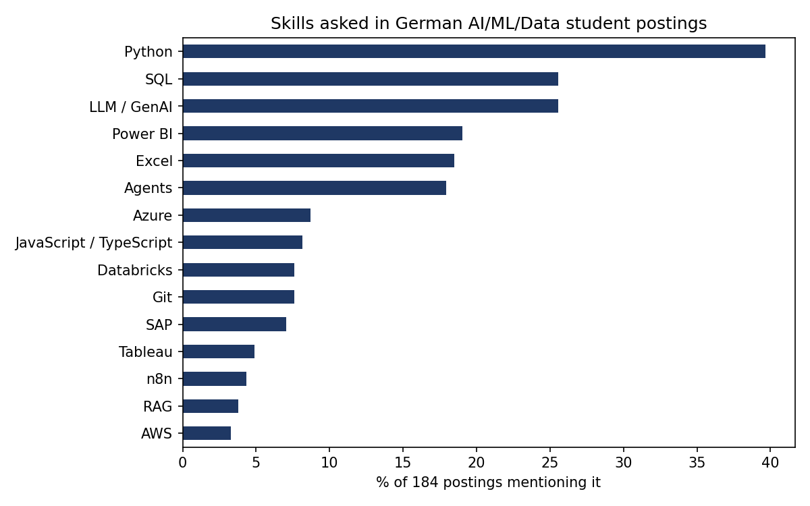

# JobPulse

What do German AI / ML / data student jobs actually ask for, and how much German do they really need?

I built this while applying for AI working student roles myself. Job boards show one posting at a time; I wanted the whole picture, from my own dataset instead of a clean Kaggle file.



## Data

- **Source:** the public job search API of the Bundesagentur für Arbeit (the one behind arbeitsagentur.de). LinkedIn, Indeed and StepStone forbid scraping in their terms, so they are not used.
- **Collected:** 519 postings from 10 searches ("Werkstudent KI", "Praktikum Machine Learning", ...), 26 Sep 2026, rate-limited, raw JSON cached per posting.
- **Cleaned:** search terms like "Werkstudent KI" also return sales and controlling jobs, so only postings whose title is really an AI/data role are kept: **184 of 519**. Stubs that only link to an external page are dropped.

## Findings

Full numbers in [`results.md`](results.md).

- **Python (40%) and SQL (26%) are the baseline.** LLM / GenAI is already in a quarter of postings, level with SQL.
- **Business tools matter more than ML frameworks:** Power BI (19%) and Excel (19%) are asked far more often than PyTorch (3%) or TensorFlow (1%). Many "AI" student jobs are about applying AI in a business, not training models.
- **German:** 41% ask for fluent (C1+) German and another 14% for good German. Only 3% call German optional. The 43% that don't mention it are all written in German, so German is usually implied there too.
- **Home office** is possible in only 16% of postings, and München (30) has more postings than Berlin and Hamburg combined (21).

## Can you tell from the title whether fluent German is required?

A practical question when you can't read hundreds of descriptions: does the title, company and city predict the German requirement?

| Model (5-fold CV) | F1 | Accuracy |
|---|---|---|
| Random guess at the class rate | 0.476 | - |
| Always "not fluent" | 0.000 | 0.592 |
| TF-IDF + logistic regression | 0.529 | 0.587 |

**Honest answer: no.** The model is only slightly better than guessing on F1 and not better than the majority baseline on accuracy. The German requirement lives in the description, not in the title, so there is no shortcut: you have to read it.

## Match a CV to the postings

The analysis above tells you what the market asks for. `match.py` turns the same data into a tool: give it a plain-text CV and it ranks the postings, shows the German level each one requires, and lists which of the 28 tracked skills you already have and which are your gap. It reuses the content-based recommender idea from my earlier CineMatch project (TF-IDF plus cosine similarity) and the multilingual embedding model from ResumeLens (`paraphrase-multilingual-mpnet-base-v2`, local, no API key), now applied to real postings. Long postings are split into overlapping 100-word chunks before embedding, because the model only reads about 128 tokens and would otherwise ignore most of each ad.

```bash
pip install -r requirements-embeddings.txt
python match.py examples/sample_cv.txt --k 5 --max-german "good (B1-B2)"
```

```
 1. Praktikant/Werkstudent (m/w/d) AI Systems & Generative AI  [Weiterstadt]  score=0.680  german=not mentioned
      you have: Agents, LLM / GenAI, LangChain / LangGraph, Python, RAG   |   gap: n8n
 2. Werkstudent*in Produktionsqualität Schwerpunkt Data Science  [Düsseldorf]  score=0.671  german=good (B1-B2)
      you have: Python, SQL   |   gap: Excel, Power BI
```

Three rankers are available: `tfidf`, `embedding` (default) and `hybrid` (reciprocal-rank fusion of the two).

### How good is it? (a proxy, not a measure of CV fit)

There are no real "this CV fits this job" labels, so I can't measure fit. What I can measure is whether a ranker finds postings of the **same role type** (GenAI/agents, data engineering, BI/analytics, ML/data science, labelled from the title by keyword rules). Each of 69 postings with a specific role type is used as a query, using its description only (title excluded), against all 184 postings, leave-one-out. Details in [`matching_results.md`](matching_results.md).

| Ranker | Precision@5 (95% CI) | MRR |
|---|---|---|
| Random ranking | 0.118 | - |
| TF-IDF | 0.191 (0.148 to 0.235) | 0.452 |
| **Embeddings** | **0.258** (0.206 to 0.310) | **0.534** |
| Hybrid (fusion) | 0.252 (0.200 to 0.304) | 0.503 |

- **Embeddings beat TF-IDF:** +0.067 precision@5 on the same queries (95% CI +0.014 to +0.122). The interval only just excludes zero, so this is real but not large.
- **Hybrid adds nothing over embeddings alone:** -0.006 (CI -0.035 to +0.026). I kept it as an option, not the default.
- **The absolute level is low:** the best ranker finds a same-role neighbour about 1 time in 4 among the top 5, against 0.12 for random. Role labels come from title keywords and many postings blur categories ("Data Analytics & Data Science"), so the ceiling is well below 1.0, but this is not a number to oversell.
- **What actually makes it useful** is the skill-gap and German-level columns, which are rule-based and covered by unit tests, not the similarity score.

## Limits

- **Sampling bias:** all 184 relevant postings are in German. English-first employers mostly post on LinkedIn, which isn't scraped, so the German shares are an upper bound for the whole market.
- **Labels are rules, not people:** skills and German level come from regular expressions. They are spot-checked on real postings and covered by [`test_rules.py`](test_rules.py), but not hand-labelled at scale.
- **One snapshot:** a single day in September 2026.
- **Matching is unvalidated against real outcomes:** the proxy evaluation above only checks role-type similarity. `examples/sample_cv.txt` is a skills summary of my own profile, and the dual-study/apprenticeship filter in the CLI is a title heuristic.

## Run it

```bash
pip install -r requirements.txt
python scrape.py      # ~10 min, writes data/postings.csv (not committed: the ad texts belong to the employers)
python analyze.py     # writes results.md and skills.png
python test_rules.py  # checks the German-level rules
pytest -q             # matcher, ranking and evaluation tests (no model download needed)

pip install -r requirements-embeddings.txt
python match.py examples/sample_cv.txt --k 5
python evaluate_matching.py   # writes matching_results.md
```
